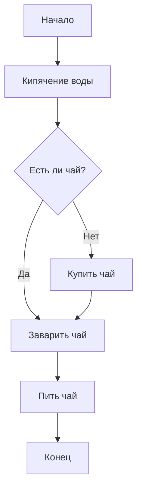
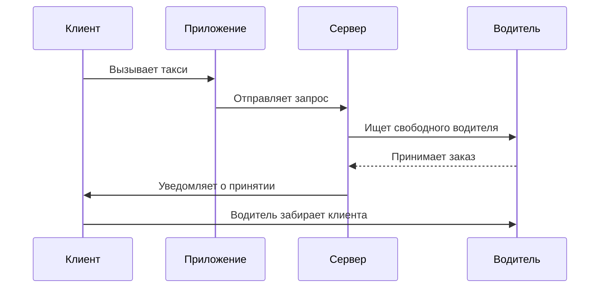

# Приготовление чая — Блок-схема Mermaid from Regent1911

```mermaid
graph TD
    A[Начало] --> B[Кипячение воды]
    B --> C{Есть ли чай?}
    C -->|Да| D[Заварить чай]
    C -->|Нет| E[Купить чай] --> D
    D --> F[Пить чай]
    F --> G[Конец]
```

# Заказ такси — Блок-схема Mermaid from Regent1911

```mermaid
sequenceDiagram
    participant Клиент
    participant Приложение
    participant Сервер
    participant Водитель

    Клиент->>Приложение: Вызывает такси
    Приложение->>Сервер: Отправляет запрос
    Сервер->>Водитель: Ищет свободного водителя
    Водитель-->>Сервер: Принимает заказ
    Сервер->>Клиент: Уведомляет о принятии
    Клиент->>Водитель: Водитель забирает клиента
```
<!--Задание 2.1: Диаграмма классов UML-->
<!--coming soon-->