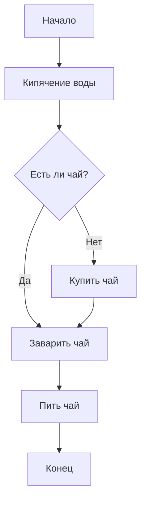
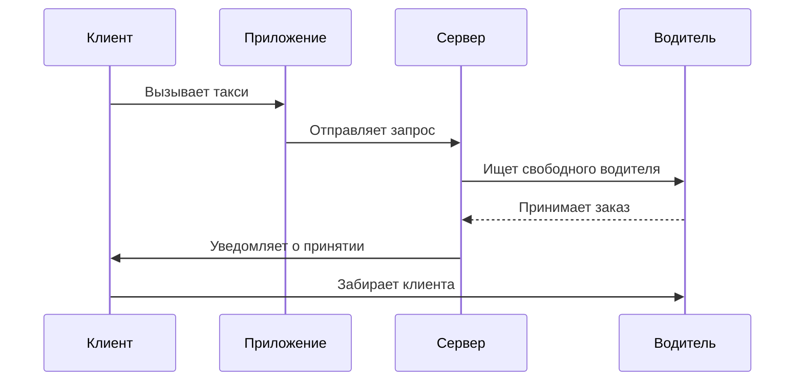
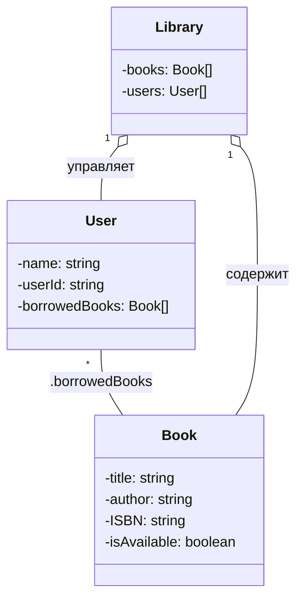

# Задания по Mermaid для студентов

## Приготовление чая — Mermaid from Regent1911

## Заказ такси — Mermaid from Regent1911

<!--Задание 2.1: Диаграмма классов UML-->
## Библиотечная система — Mermaid from Regent1911

## Coming Soon<...>
<!--coming soon-->